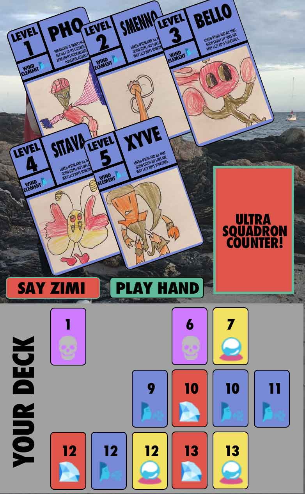

ZIMI README!

What this is:

ZIMI is a game based on my son Zephyr's homemade Pokemon cards (that's Zephyr in the landing page and such). I based the game play on Big Two (also called Deuces or Chinese Poker), a popular poker variant in Asia that took over the halls of my high school back in the 90's.

Explanation of technologies used:
I used the jQuery library to help cut down on the code a little, but very lightly (and it didn't cut down on the code much, honestly). Otherwise, it's pretty much all javascript. I created the graphics in photoshop, I guess, and I used the adobe palette picker to help me select a nice color combo?

Approach taken:
I did a lot of whiteboarding for this game. I made some very elaborate flowcharts (most recent one at https://www.lucidchart.com/invitations/accept/12fae46b-99c4-4d66-b1b2-2afa3a38e7e9) trying to work out the rules of poker and distill them into logical operators. Big two essentially works in 4 categories of card combinations - 1 card hands, 2 card hands, 3 card hands, and 5 card hands. Working it out in pseudocode, I realized there's 52 distinct single card combination values possible, 39 distinct pair combination values possible, 26 triple combination values possible, and 130 five card combination values possible. By inputting what each combo would logically look like and how each of the 270 combination values could be set, I'm pretty sure you can make the game.

User stories:
This is made in a big way for my 9 year old son and his friends, so I wanted to make something using the rules of poker that could appeal to kids. I tried to make the cards feel colorful and bold, matching colors and numbers rather than just suits and numbers.

Wireframes:

How to use instructions:
There's some instructions on the landing page which should cycle through... click on the cards in the deck to build 1, 2, 3, or 5 card hands, and your opponent tries to play higher card combos. When you or your opponent can't make a higher combo, you have to say Zimi and concede your turn. First one to use all their cards wins!

Unsolved problems:
As of this writing (7a on 10/12), there's still an issue with my "build deck" for player 2 that's preventing me from playing through the game. Gonna try and fix that this morning at 9a.

Still to make on the game:
I'm going to be honest with you, there's a LOT I still have to do for this game. I have to make the actual cards featuring my kids' drawings, I have to put in the animations, I'd like to make things drag and drop instead of clickable, and I want to make sure the focus of this game is mobile-first.
